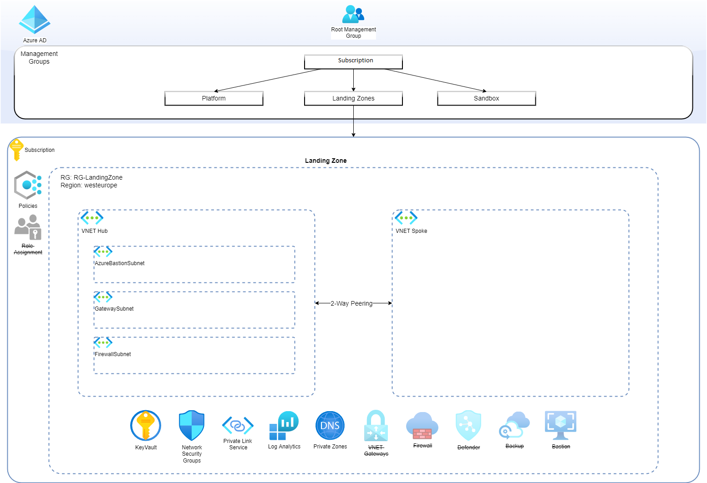

# Introduction 
This structure contains the modules and pipelines necessary to create landing zone sandbox, consisting of:
- Log analytics workspace
- Key Vault
- HUB-Spoke Virtual Networks (Subnet/NSG)
- Policy Definitions
- Policy Assignments
- Private DNS Zones
- Firewall (Disabled for cost savings)

# Structure
The project is split into the following areas:
- CRML - Auxiliary modules used by the ALZ modules 
- Modules - folder containing modules required by the pipelines to provision the resources. These modules are provided by Microsoft Azure Bicep team (https://github.com/Azure/ALZ-Bicep) and customizations are strongly discouraged, except the update of resource versions which are not updated as often and modules developed internally:
    * AzureADDS
    * AzureSQL
    * Backup
    * Keyvault
    * LocalNetworkGateway
    * Monitor
    * NetworkSecurityGroup
    * PolicySubscription
    * PrivateEndpoint
    * Security
    * StorageAccount
    * Subnets
    * Virtual Machine
    * VirtualNetworks (HubNetworking)
- Templates - here all pipelines and Bicep orchestration files should be stored.

# Templates
These template pipelines were idealized to allow maximum flexibility and rely on bicep orchestration files that should receive the variables from each scenario and pass on the appropriate modules.

Following the concept used in terrafom the templates are divided in 3 stages:
- PLAN - For each type of resource to be deployed we run a 'what-if' action that will scan the environment and provide a report on what actions will be taken. If it reaches timeout, deployment will abort.
- DEPLOY - Given the plan is reviewed and approved these resources will be deployed accordingly.
- CLEANUP - After the deployment there's a manual task to, in case of a sandbox, allow the destruction of the environment. If it reaches timeout no action will be taken.

Here's the current Azure Landing Zone setup by this project:

